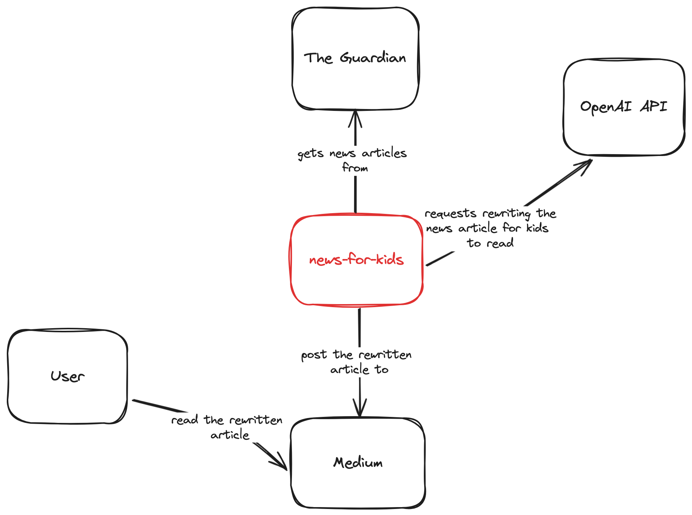
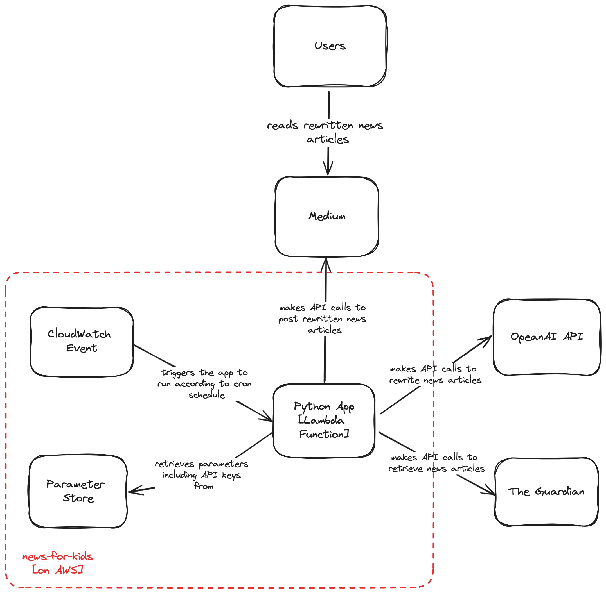

# news-for-kids
A Gen AI based application to rewrite headline news into a format suitable for kids to read. The rewritten news articles can be found here: https://medium.com/@inditang

# Disclaimers
This software project is for personal learning purpose to get a taste of Python programming and OpenAI API. It was done in limited time and definitely has much room for improvements. Some of the potential future improvements/enhancements can be found in the section [Ideas on other features](#ideas-on-other-features)

# C4 Diagrams

## System Context Diagram 

## Container Diagram 

# Prerequisites
API keys for The Guardian, OpenAI and Medium are needed for the application to work. Obtain these API keys and put them in AWS SSM Parameter Store with the names below:
- /news-for-kids/guardian-api-key
- /news-for-kids/openai-api-key
- /news-for-kids/medium-api-key

The first step is to create the necessary infrastructure. Before creating the infrastructure using the Terraform scripts in the [aws](aws) folder, you will need to first login to the AWS account which has the necessary access. Assuming an AWS profile with the name "news-dev" has been set up on your local machine, use the following command to login as the profile:

```
export AWS_PROFILE=news-dev; aws sso login
```

Then depending on whether you would like to run the application only manually from your local machine, or to deploy it as an AWS lambda function and schedule it to run periodically, run the Terraform scripts with the commands below.

To create all the infrastructure and run the application as an AWS lambda function, run the following command:

```
./tg . run-all apply
```

To create only the SSM Parameter Store and run the application only locally, run the following command:

```
./tg ssm-param-store run-all apply
```

In any case, you will then need to update the values of the API keys manually either through AWS console or CLI.

Assuming you are still using the shell with the AWS account logged in (i.e. the application will have access to the API keys stored in SSM Parameter Store), the next step to run the application manually is to run the following command:

```
make run
```

# References
- The Guardian's API Key - https://open-platform.theguardian.com/
- theguardian-api-python - https://github.com/prabhath6/theguardian-api-python
- OpenAI API Key - https://platform.openai.com/docs/api-reference/chat
- Medium API Reference - https://github.com/Medium/medium-api-docs?tab=readme-ov-file#33-posts

# Ideas on other features
1. Exception handling
2. Add tests
3. Move theguardian package to venv & lambda layer
4. CI/CD pipeline 
